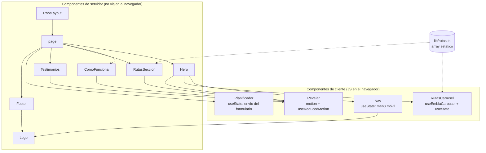
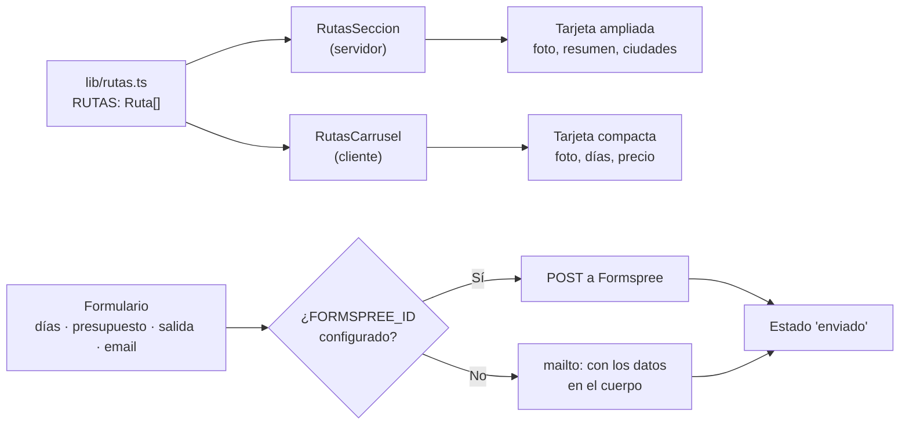
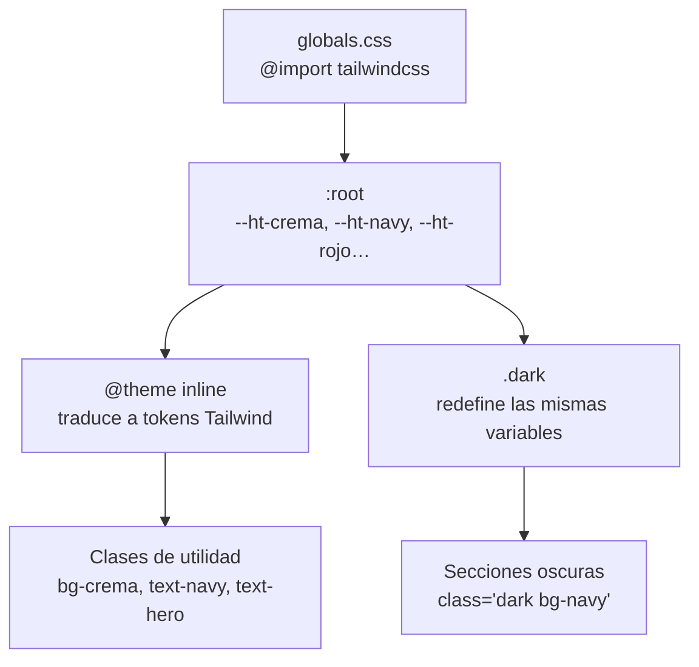

# 01 · Arquitectura y flujo de datos

> Sesión 1 · HappiTrip Landing (v1) · 2026-08-28
> Sistema analizado: `site/` — Next.js 16.3.3, React 19.2.8, Tailwind CSS 4

## 1. Qué tipo de sistema es

HappiTrip Landing es una aplicación **Next.js App Router** que se compila a HTML estático.
No tiene servidor de aplicación en ejecución, ni base de datos, ni API. Todo el contenido
se conoce en tiempo de compilación.

Esto es una decisión, no una carencia: en fase de prelanzamiento el objetivo es validar
demanda, y una página estática se sirve desde CDN, no se cae y cuesta cero.

```
Route (app)
┌ ○ /              (Static)  prerenderizado como contenido estático
└ ○ /_not-found    (Static)
```

## 2. Frontera servidor / cliente

La distinción central de React 19 con App Router. Por defecto **todo componente es de
servidor**: se ejecuta en build, no viaja al navegador y no puede tener estado. Solo se
marca `"use client"` lo que necesita interactividad.



**Cuatro componentes de cliente sobre catorce.** El resto no envía JavaScript al navegador.
El inventario completo, con el desglose por archivo, está en el artefacto 02.

## 3. Flujo de datos

El flujo es de una sola dirección y de una sola fuente:



Puntos a destacar:

- **Una sola fuente de verdad** para las rutas (`RUTAS`). Los dos componentes que las
  pintan leen del mismo array; no hay duplicación de datos. Es la aplicación práctica de
  DRY en la capa de datos.
- **No hay estado global.** Ni Context, ni Redux, ni Zustand. El único estado que existe
  es local a tres componentes y no se comparte entre ellos.
- **No hay prop drilling.** Ningún dato atraviesa más de un nivel de componentes.

## 4. Cómo llegan los estilos



La clase `.dark` **no** se aplica al documento: se aplica a las secciones que deben ir
sobre fondo oscuro. Redefine las variables de color en su subárbol, de modo que los mismos
componentes funcionan en claro y en oscuro sin condicionales en el código.

## 5. Decisiones de arquitectura y su motivo

| Decisión | Motivo | Coste asumido |
|---|---|---|
| Estático en vez de servidor | Prelanzamiento: no hay datos que cambien | Cambiar contenido exige recompilar |
| Datos en un `.ts` y no en CMS | Cuatro rutas escritas una vez | No editable por alguien no técnico |
| Sin estado global | Ningún dato se comparte entre secciones | Habrá que introducirlo en v2 |
| `motion` en vez de CSS puro | Revelado al hacer scroll con control de interrupción | ~30 kB de JS y dependencia de que el JS cargue |
| Componentes propios en vez del CLI de shadcn | El CLI se colgó; se escribieron a mano | Mantenimiento manual de los componentes |

## 6. Riesgo detectado

Las animaciones de entrada arrancan en `opacity: 0`. Si el JavaScript no se ejecuta, el
contenido queda invisible. Se mitigó con un bloque `<noscript>` en `layout.tsx` que fuerza
la opacidad a 1. **Trazabilidad:** `site/src/app/layout.tsx`, sección `<head>`.

Este riesgo se detectó al capturar la página con una herramienta que no hace scroll real:
las secciones salían vacías. Es un ejemplo de que verificar un artefacto (la captura)
reveló un defecto que la revisión de código no había visto.
