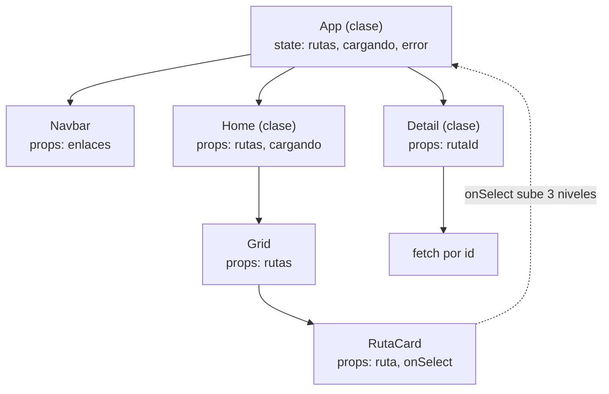
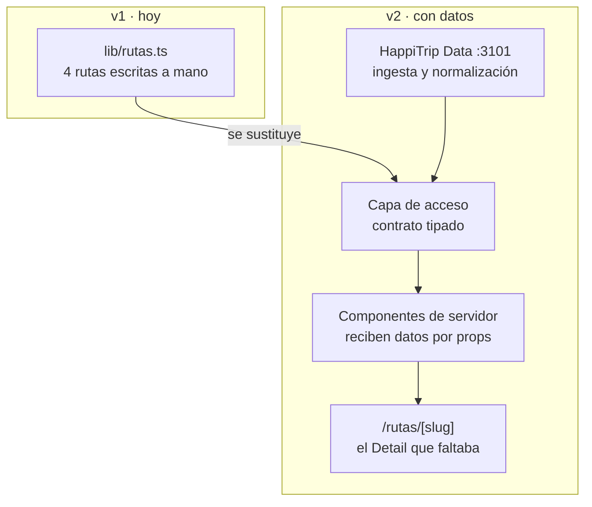

# 04 · Plan de migración conceptual

> Sesión 1 · HappiTrip · 2026-08-28 · **Sin código**
> Este artefacto define tres estados del sistema y las transiciones entre ellos.

## 1. Por qué este plan va en dos direcciones

El enunciado original pedía analizar un sistema React 18 legacy y planificar su migración a
React 19. HappiTrip **ya está en React 19**, así que no hay migración hacia delante que
planificar. En lugar de fingir lo contrario, el ejercicio se reformula en dos tramos:

- **Tramo A · v0 → v1 (retrospectivo).** Se especifica la versión legacy que HappiTrip
  *habría sido* en React 18, y se documenta la migración hasta el estado actual. Es la
  competencia que pedía el enunciado, con una ventaja: el destino ya existe y es
  verificable, no hipotético.
- **Tramo B · v1 → v2 (prospectivo).** La evolución real del producto: de landing estática
  a aplicación con datos. Es el plan que de verdad se va a ejecutar.

El Tramo A se materializa en el módulo **HappiTrip v0 (Legacy Lab)**, puerto 3103.

## 2. Especificación de la v0 legacy

Sistema React 18 que hay que construir **deliberadamente con los patrones que hoy se
evitan**, para tener un objeto de estudio real en lugar de uno imaginado.

| Aspecto | v0 legacy (React 18) | v1 actual (React 19) |
|---|---|---|
| Componentes | Clases con `render()` | Funciones |
| Estado | `this.state` + `setState` | `useState` |
| Ciclo de vida | `componentDidMount` / `DidUpdate` / `WillUnmount` | `useEffect` con función de limpieza |
| Datos | `fetch` en `componentDidMount` de `App` | Resueltos en compilación |
| Propagación | `App` → `Home` → `Grid` → `RutaCard` por props | Importación directa del módulo de datos |
| Enrutado | `react-router-dom` v5 | App Router de Next.js |
| Estilos | CSS Modules o styled-components | Tailwind 4 con variables CSS |
| Renderizado | Solo cliente (SPA con `create-react-app`) | Estático prerenderizado |

### Jerarquía de la v0

Los dos defectos que este diagrama debe hacer evidentes:

1. **Prop drilling.** `rutas` recorre `App → Home → Grid → RutaCard`. Los dos niveles
   intermedios no usan el dato: solo lo transportan. Cambiar la forma de `Ruta` obliga a
   tocar cuatro archivos.
2. **Callback ascendente.** `onSelect` sube tres niveles para que `App` cambie de vista.
   El acoplamiento es bidireccional y ninguno de los intermedios puede reutilizarse.

## 3. Tramo A · Migración v0 → v1

Seis pasos, en este orden. El orden importa: cada uno deja el sistema en estado
funcionante y verificable.

| # | Paso | Qué resuelve | Cómo se verifica |
|---|---|---|---|
| 1 | Clases → funciones, `setState` → `useState` | Elimina el ciclo de vida disperso | La interfaz se comporta igual; suite de pruebas en verde |
| 2 | `componentDidMount` → `useEffect` con limpieza | Fugas de suscripciones al desmontar | No quedan escuchas activas tras navegar |
| 3 | Extraer los datos a un módulo (`lib/rutas.ts`) | Rompe el prop drilling en su origen | `Grid` y `Card` dejan de recibir `rutas` por props |
| 4 | SPA → App Router con componentes de servidor | Elimina JavaScript innecesario en el navegador | Menos JS enviado; contenido presente en el HTML inicial |
| 5 | Enrutado propio → segmentos de Next.js | Rutas y layouts anidados sin biblioteca extra | Se puede borrar `react-router-dom` |
| 6 | CSS Modules → Tailwind con variables | Un solo sistema de tokens, tema oscuro sin duplicar | La paleta cambia desde un único archivo |

**Criterio de parada.** La migración termina cuando el paquete enviado al navegador solo
contiene los cuatro componentes que necesitan interactividad. Cualquier otro componente que
siga en el cliente indica un paso incompleto.

**Riesgo principal.** El paso 4 es el único que no es mecánico: exige decidir qué componente
necesita ser de cliente y cuál no. Un error aquí no rompe la compilación, solo empeora el
rendimiento en silencio. Debe revisarse componente por componente, no en bloque.

## 4. Tramo B · Evolución v1 → v2

De landing estática a aplicación con datos.

Cambios que exige, en orden de dependencia:

1. **Invertir el acoplamiento de datos.** Hoy `RutasSeccion` y `RutasCarrusel` importan
   `RUTAS`. En v2 deben recibirla por props desde el componente de servidor, para poder
   alimentarse de cualquier fuente. Es el punto registrado en el artefacto 02.
2. **Definir el contrato antes que la fuente.** El tipo `Ruta` ya existe y funciona como
   contrato provisional. Debe congelarse y versionarse antes de conectar la API, no después.
3. **Introducir `/rutas/[slug]`.** Es el `Detail` ausente. Requiere `generateStaticParams`
   si el catálogo es acotado, o renderizado bajo demanda si crece.
4. **Decidir la estrategia de revalidación.** Estático con revalidación periódica mientras
   los datos cambien poco; bajo demanda cuando cambien a menudo. Esta decisión debe tomarse
   con datos de uso reales, no por adelantado.

**Lo que no cambia.** El sistema de diseño, los componentes de presentación y la estructura
de secciones sobreviven intactos a la v2. Ese es el resultado de haber separado datos y
presentación en la v1, y es el argumento más fuerte a favor de la arquitectura elegida.

## 5. Qué se entrega en cada versión

| Versión | Módulo | Puerto | Estado |
|---|---|---|---|
| v0 | HappiTrip v0 (Legacy Lab) | 3103 | Especificado en este documento, sin construir |
| v1 | HappiTrip Landing | 3100 | Construido y compilando |
| v2 | HappiTrip Landing + Data | 3100 + 3101 | Planificado, Sesión 2 |
