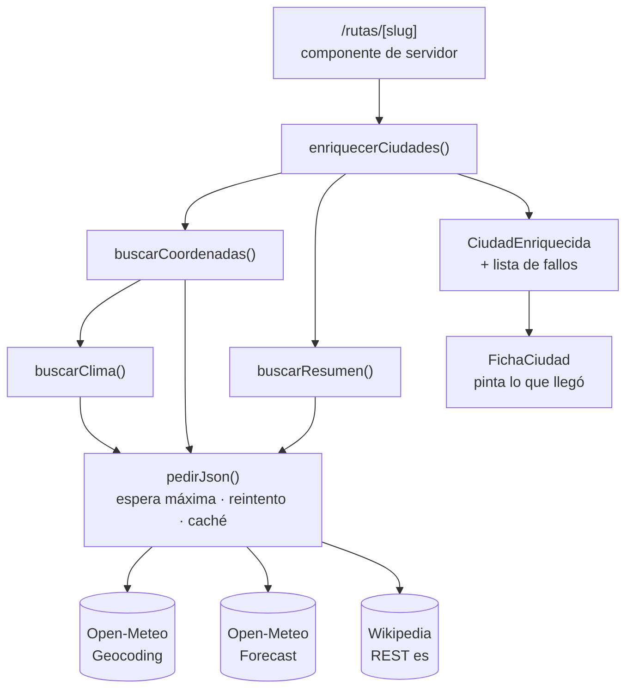

# S2-01 · Capa de datos y consumo de fuentes externas

> Sesión 2 · HappiTrip v0.2.0 · 2026-08-28
> Código: `site/src/lib/data/` · Consumidor: `site/src/app/rutas/[slug]/page.tsx`

## 1. Evaluación de fuentes

Se evaluaron cinco candidatas **antes** de escribir código, comprobando cada una con una
petición real. Dos se descartaron por motivos que solo aparecen al probarlas.

| Fuente | Clave | Licencia | Veredicto |
|---|---|---|---|
| **Open-Meteo Geocoding** | No | CC BY 4.0 | **Aceptada.** Devuelve coordenadas, país, zona horaria y población. Responde en español |
| **Open-Meteo Forecast** | No | CC BY 4.0 | **Aceptada.** Temperaturas y precipitación diarias |
| **Wikipedia REST (es)** | No | CC BY-SA | **Aceptada.** Resumen e imagen por ciudad |
| REST Countries v3.1 | No | — | **Descartada.** La propia API responde: *«This API version has been deprecated»* |
| Nominatim (OSM) | No | ODbL | **Descartada.** Exige un máximo de una petición por segundo y un `User-Agent` identificable. Complica la compilación sin aportar nada que Open-Meteo no dé ya |

**El hallazgo del descarte de REST Countries es el argumento de por qué se prueba antes de
integrar.** La documentación pública de esa API sigue apareciendo en buscadores como
vigente; solo la petición real revela que está deprecada. Integrarla a ciegas habría dejado
una dependencia rota en producción.

## 2. Arquitectura de la capa



Cuatro archivos, cada uno con una responsabilidad:

| Archivo | Responsabilidad |
|---|---|
| `tipos.ts` | Contratos. Nadie más define la forma de los datos |
| `cliente.ts` | Transporte: espera máxima, reintento, caché, forma del error |
| `fuentes.ts` | Traduce cada respuesta cruda al contrato. **Fuera de aquí nadie conoce la forma que devuelve un tercero** |
| `index.ts` | Composición. Es lo único que importa el resto de la aplicación |

**Regla de aislamiento.** Si mañana Open-Meteo cambia el nombre de un campo, solo cambia
`fuentes.ts`. Ni los componentes ni las páginas se enteran. Es la aplicación de DRY al
punto que más se repite en un proyecto con datos externos: la traducción.

## 3. Contrato: todo lo externo es opcional

Decisión central del diseño:

> Obligatorio es solo lo que controlamos nosotros. Todo campo que venga de una API externa
> se declara opcional.

```ts
export type CiudadEnriquecida = Ciudad & {
  coordenadas?: Coordenadas
  clima?: Clima
  resumen?: ResumenEnciclopedico
  fallos: MotivoFallo[]
}
```

`fallos` **no** es opcional: siempre hay una lista, aunque esté vacía. Esto obliga a que el
código que consume decida qué hacer con los fallos en lugar de poder ignorarlos por
descuido.

En lugar de excepciones, las funciones devuelven un resultado explícito:

```ts
export type Resultado<T> =
  | { ok: true; dato: T }
  | { ok: false; motivo: MotivoFallo; detalle: string }
```

Una excepción se puede olvidar de capturar; un tipo así no se puede leer sin comprobar `ok`
primero. El compilador se convierte en la garantía.

## 4. Resiliencia

| Modo de fallo | Detección | Respuesta | Qué ve el visitante |
|---|---|---|---|
| Tiempo de espera agotado | `AbortSignal.timeout(8s)` | Un reintento, luego se abandona | La ficha sin ese bloque |
| Error 5xx | `respuesta.ok === false` | Un reintento | La ficha sin ese bloque |
| Error 4xx | Código entre 400 y 499 | **Sin reintento**: insistir no arregla una petición mal formada | La ficha sin ese bloque |
| Ciudad sin resultados | Array `results` vacío | `sin-resultados` | Sin datos de país ni clima |
| Imagen de host inesperado | Lista blanca de dominios | Se descarta la imagen | Ficha sin foto, con texto |
| Geocodificación caída | Fallo previo | El clima **no se pide** | Sin clima, y no se cuenta el fallo dos veces |

**Regla de producto:** el visitante nunca ve un error de red. O hay dato, o ese trozo no
aparece. Solo cuando *todas* las fuentes de una ciudad fallan se muestra un aviso, en tono
neutro.

**Verificación.** El build compila las cuatro rutas con sus dieciséis ciudades sin un solo
aviso de fallo en el registro. Los fallos, cuando ocurren, se escriben con `console.warn`
para que queden en el log de compilación sin interrumpirla.

## 5. Caché y coste

- **Una hora de revalidación.** Los datos de viaje cambian despacio y la previsión
  meteorológica se actualiza por horas, no por minutos.
- **Prerenderizado en compilación** con `generateStaticParams`: el visitante recibe HTML ya
  resuelto y no espera a ninguna API.
- **Coste por compilación:** 16 ciudades × 3 peticiones ≈ 44 llamadas. Muy por debajo de los
  límites de Open-Meteo, y Wikipedia no impone cuota a este volumen.

## 6. Dos defectos encontrados y su lección

**Wikipedia sirve imágenes desde varios subdominios.** El build de producción pasó con
`upload.wikimedia.org` autorizado; el servidor de desarrollo devolvió
`thumb.wikimedia.org` y la página cayó con error 500. `next/image` lanza si recibe un host
no autorizado.

Se corrigió en dos capas, y esa duplicidad es deliberada: se amplió el patrón de
`next.config.ts` a `**.wikimedia.org` **y** se añadió una lista blanca en `fuentes.ts` que
descarta cualquier imagen de origen inesperado. La configuración resuelve el caso conocido;
la validación protege del caso que aún no ha ocurrido.

> **Lección.** Que una respuesta de API funcione una vez no dice nada sobre su forma
> estable. Un campo que hoy trae un host puede traer otro mañana, y el sistema debe
> degradar en lugar de caer.

**«Santiago» geocodifica a Santiago de Chile.** El nombre corto de una ciudad puede ser
ambiguo a escala mundial. Se añadió al contrato un campo `buscar` que separa lo que se
muestra de lo que se consulta.

> **Lección.** El identificador de búsqueda y la etiqueta de presentación son dos cosas
> distintas, aunque coincidan en el 90 % de los casos.

## 7. Dependencias añadidas

**Ninguna.** La capa entera usa `fetch`, `AbortSignal` y `URL`, todos nativos. Aplicación
directa de la norma escrita en el artefacto 03 tras el episodio de los paquetes huérfanos:
justificar antes de instalar.

## 8. Estado de los issues afectados

| Issue | Estado |
|---|---|
| #6 Definir el contrato de datos | **Cerrado.** `tipos.ts` |
| #1 Invertir el acoplamiento de datos | **Parcial.** La página de detalle recibe los datos por props; el carrusel y la rejilla de la portada siguen importando `RUTAS` |
| #3 Tarjeta de ruta duplicada | Sin cambios. El disparador —una tercera variante— no se ha alcanzado |
